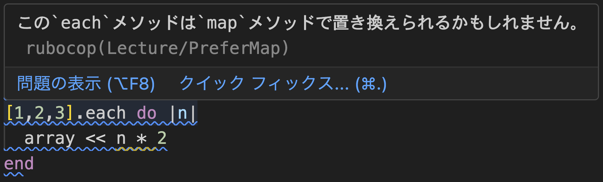
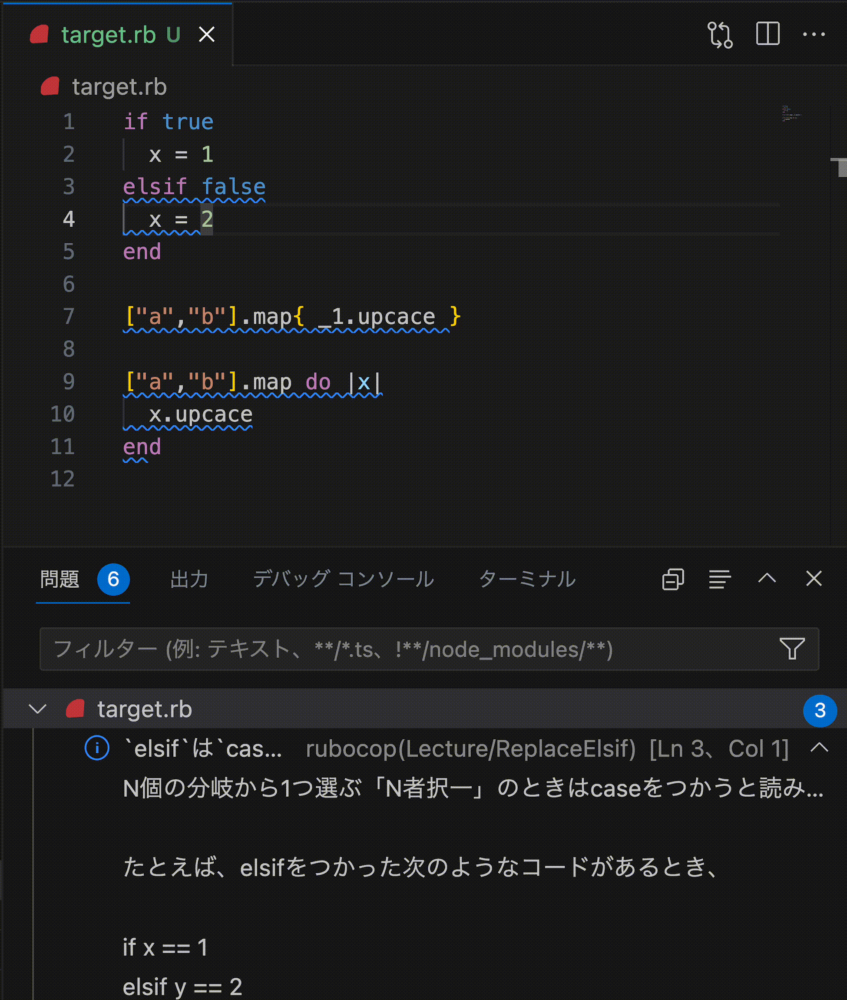

# RuboSensei

- RuboSensei は書いたRuby/Railsコードに対して、より良い書き方を教えてくれるツールです
- RuboCop Gem の仕組みをつかっています
- rubocopコマンドで良い書き方のアドバイスが表示されます
- RuboCop に標準で入っているLSPをつかうとエディタ上で書いたコードのそばに表示できます




# 実装されているアドバイス

- [config/default.yml](config/default.yml)

# つかい方

## インストール

- Gemfile に以下を追加します。

```ruby
group :development do
  gem "rubocop", require: false
  gem "rubocop-sensei", require: false
end
```

- bundle installを実行します
  - $ bundle install

- .rubocop.yml へ以下を追加します

```yaml
require:
  - rubocop-sensei

Lecture:
  Enabled: true
```

## rubocopコマンドからつかう

- rubocop コマンドを実行します
  - $ bundle exec rubocop

- rubocop コマンドに `--autocorrect` オプションを渡すと、対応している項目は自動修正も行います
  - $ bundle exec rubocop --autocorrect

- 実行結果例

```
app/models/book.rb:12:5: C: Lecture/PreferMap: このeachメソッドはmapメソッドで置き換えられるかもしれません。

    array.each do |x| ...
    ^^^^^^^^^^^^^^^^^
```

## VSCode で書いているコード上にアドバイスする

- VSCode で書いているコード上でリアルタイムにアドバイスを表示できます
  - RuboCopに標準で入っているLSP機能と、VSCode拡張 vscode-rubocop をつかいます
- VSCode拡張 vscode-rubocop をVSCodeへインストールして有効にします
  - https://marketplace.visualstudio.com/items?itemName=rubocop.vscode-rubocop
- rubocopコマンドが実行可能になっていれば、自動でRuboCopを実行して結果を表示します
  - 手動でLSPを起動するコマンドを実行する必要はありません

# .rubocop.yml の書き方例

- RuboSenseiのアドバイスはLectureカテゴリとしてまとめられています

## プロジェクトの.rubocop.ymlがないとき

- たとえば次のような内容で作成します
- RuboCopデフォルトの検査のうちStyle, LintカテゴリだけをONにして、RuboSenseiのアドバイス(Lectureカテゴリ)をONにするときの.rubocop.ymlの例

```
AllCops:
  NewCops: enable
  SuggestExtensions: false

require:
  - rubocop-sensei

Style:
  Enabled: true

Lint:
  Enabled: true

Lecture:
  Enabled: true
```

- RuboCopデフォルトの検査をオフにしてRuboSenseiのアドバイス(Lectureカテゴリ)をONにするときの.rubocop.ymlの例

```yaml
AllCops:
  DisabledByDefault: true

require:
  - rubocop-sensei

Lecture:
  Enabled: true

Lecture/ReplaceElsif:
  Enabled: true
```

## プロジェクトの.rubocop.ymlがあるとき

- require設定に rubocop-sensei を追加します

```yaml
require:
  - rubocop-sensei
```

- カテゴリ設定に Lecture を有効にする設定を追加します

```yaml
Lecture:
  Enabled: true
```

## アドバイスを非表示にするとき

- RuboSenseiのアドバイス表示時に書かれている名前を指定してEnabled: false設定を追記します

```yaml
Lecture:
  Enabled: true

Lecture/ReplaceElsif:
  Enabled: false
```

- 全アドバイスをオフにするときはLectureカテゴリをEnabled: falseにします
  - または、Lectureカテゴリの設定を削除します

```yaml
Lecture:
  Enabled: false
```

# License

- Apache License Version 2.0
  - https://www.apache.org/licenses/LICENSE-2.0
- (RuboSensei v0.1.4 まではMITライセンス)
